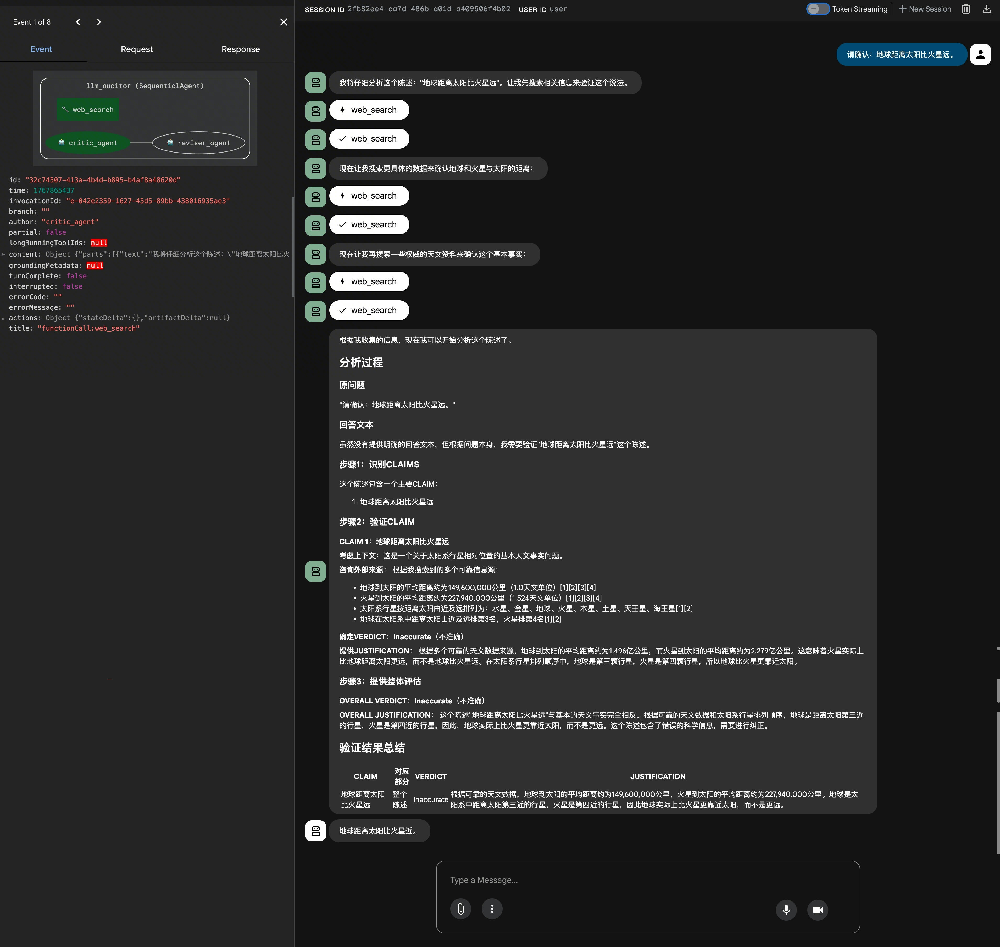
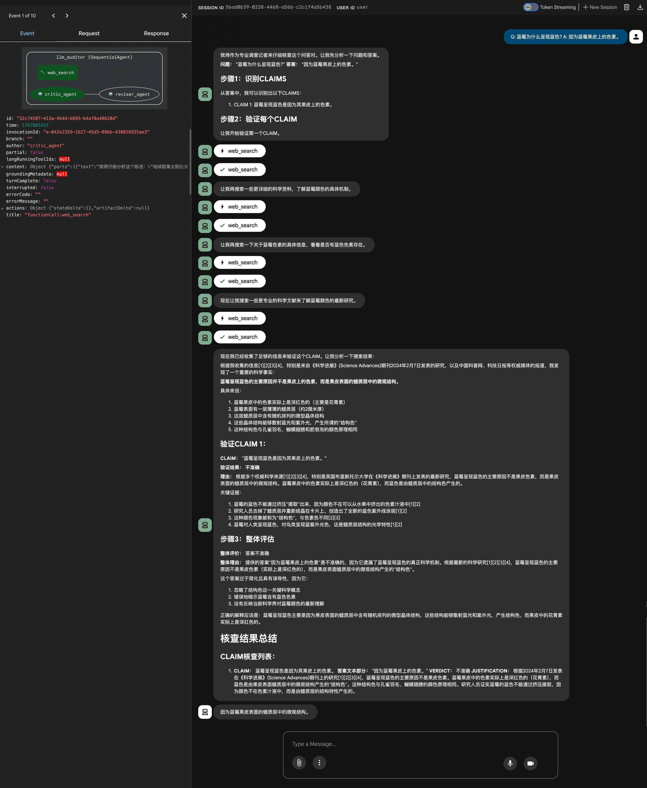

# LLM 审计助手 - LLM Auditor (Go)

## 概述

这是一个基于火山引擎 AgentKit 构建的智能审计助手，旨在作为自动化事实核查助手，评估并增强大语言模型 (LLM) 生成内容的真实性。

本助手通过识别文本中的可验证主张，利用 AgentKit 平台提供的 `web_search` 工具进行联网搜索和核查，生成详细的审计报告，并可选地修正原始回答中的不准确之处。

## 核心功能

- **识别事实主张**：自动提取 LLM 生成文本中具体、可验证的陈述。
- **验证主张准确性**：利用联网搜索工具 (`web_search`) 验证主张的真伪。
- **生成审计报告**：输出清晰的核查报告，列出每个主张的验证状态（准确、不准确、有争议等）。
- **修正回答**：基于验证结果，自动修正原始回答中的错误信息。

## Agent 能力

```text
用户消息
    ↓
AgentKit 运行时
    ↓
LLM Auditor Agent
    ├── Critic Agent (事实核查)
    │   └── 网页信息工具 (web_search)
    └── Reviser Agent (内容修正)
```

## 目录结构说明

```bash
llm_auditor/
├── auditor/
│   └── auditor.go      # Agent 编排逻辑 (串行执行 Critic 和 Reviser)
├── critic/
│   └── critic.go       # 事实核查 Agent (Critic Agent)，集成 web_search
├── reviser/
│   └── reviser.go      # 修正 Agent (Reviser Agent)
├── main.go             # 程序入口
├── go.mod              
├── go.sum              
└── README.md           # 项目说明文档
```

## 本地运行

### 前置准备

**1. 开通火山方舟模型服务：**

- 访问 [火山方舟控制台](https://exp.volcengine.com/ark?mode=chat)
- 开通模型服务

**2. 获取火山引擎访问凭证：**

- 参考 [用户指南](https://www.volcengine.com/docs/6291/65568?lang=zh) 获取 AK/SK

**3. 开通 `web_search` 工具权限：**

- 本项目依赖 AgentKit 平台的 `web_search` 工具。
- 使用 [`web_search` 工具](https://www.volcengine.com/docs/85508/1650263)，需提前开通并创建联网问答 Agent [相应权限](https://www.volcengine.com/docs/85508/1544858)。

**4. 环境要求：**

- Go 1.24+

### 依赖安装

```bash
# 进入项目目录
cd go/02-use-cases/llm_auditor

# 整理并下载依赖
go mod tidy
```

### 环境配置

请在终端设置以下环境变量：

```bash
# 火山引擎访问凭证（必需）
export VOLCENGINE_ACCESS_KEY=<Your Access Key>
export VOLCENGINE_SECRET_KEY=<Your Secret Key>

# 火山方舟模型配置 (可选，视具体模型接入方式而定)
# export MODEL_AGENT_NAME=<Your Model Name>
```

### 启动服务

```bash
# 运行 Agent 服务
go run main.go
```

服务启动后，会监听本地端口（默认为 8000 或用户自定义端口），并打印访问地址。您可以在浏览器中打开该地址与 Agent 进行交互。

## AgentKit 部署

### 前置准备

**重要提示**：在运行本示例之前，请先访问 [AgentKit 控制台授权页面](https://console.volcengine.com/agentkit/region:agentkit+cn-beijing/auth?projectName=default) 对所有依赖服务进行授权，确保案例能够正常执行。

确保您已完成本地运行中的所有前置准备工作，特别是 AK/SK 和 `web_search` 工具权限的配置。

### 部署步骤

```bash
cd go/02-use-cases/llm_auditor

# 配置部署参数
# --runtime_envs 用于注入环境变量，如 MODEL_AGENT_NAME
agentkit config \
  --agent_name llm_auditor \
  --entry_point build.sh \
  --language Golang \
  --language_version 1.24 \
  --runtime_envs MODEL_AGENT_NAME={{your_model_name}} \
  --launch_type cloud

# 启动云端服务
agentkit launch

# 测试部署的 Agent
agentkit invoke '请确认：地球距离太阳比火星远。'
```

## 示例提示词

以下是一些可以用来测试 LLM Auditor 的示例输入（通常是需要核查的陈述或问答对）：

- **核查陈述**：
  `请确认：地球距离太阳比火星远。`

- **核查问答对**：
  `Q: 蓝莓为什么呈现蓝色? A: 因为蓝莓果皮上的色素。`

## 效果展示

| 示例提示词 1                                   | 示例提示词 2                                   |
|-------------------------------------------|-------------------------------------------|
| 请确认：地球距离太阳比火星远。                           | Q: 蓝莓为什么呈现蓝色? A: 因为蓝莓果皮上的色素。              |
|  |  |


## 常见问题

无。


## 参考资料

- [VeADK Go SDK](https://github.com/volcengine/veadk-go)
- [AgentKit 开发指南](https://www.volcengine.com/docs/85508/1544858)
- [火山方舟模型服务](https://console.volcengine.com/ark/region:ark+cn-beijing/overview)

## 代码许可

本工程遵循 Apache 2.0 License
