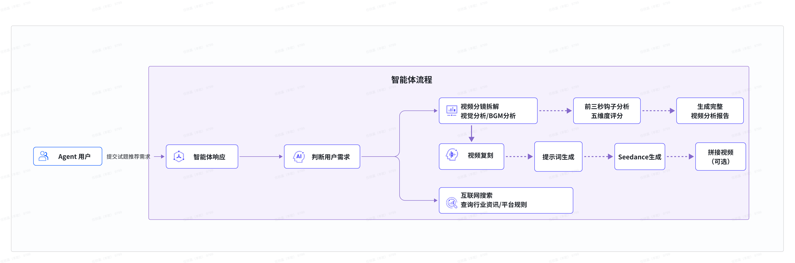
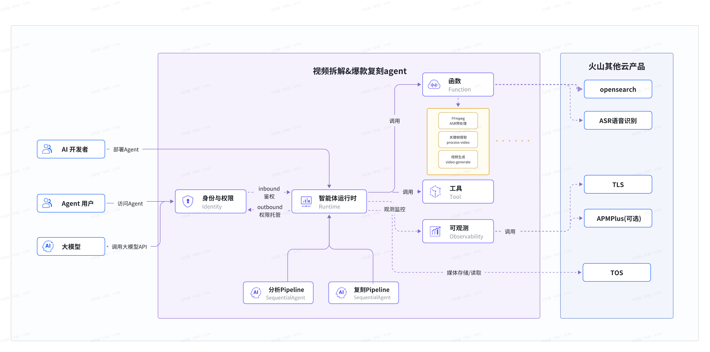

# 智能短视频拆解分析与复刻助手

## 概述

这是一个基于火山引擎 VeADK & AgentKit 构建的智能短视频分析与复刻系统。本系统采用 Multi-Agent 架构，集成 FFmpeg 视频处理、火山 ASR 语音识别、LiteLLM 多模态视觉分析、TOS 对象存储和 Doubao-Seedance 视频生成，能够对短视频进行全方位的专业分析，并支持一键复刻爆款视频。

## 核心功能

本项目提供以下核心功能：

- **视频分镜拆解**：基于 FFmpeg 自动识别视频分镜，提取关键帧并进行画面内容分析（含光影、色调、景深、构图、运动 5 个维度），输出结构化分镜数据
- **前三秒钩子分析**：从视觉冲击力、语言钩子、情绪唤起、信息密度、节奏掌控 5 个维度进行专业评分
- **专业报告生成**：整合分镜数据和钩子分析结果，生成 Markdown 格式的完整分析报告
- **联网搜索**：实时获取短视频行业最新资讯、平台规则和热门趋势
- **视频提示词生成**：LLM 主导三阶段工作流（特征提取 → 知识检索 → 组装生成），将分镜脚本转换为专业视频生成提示词
- **视频复刻生成**：调用 Doubao-Seedance 模型，支持首尾帧、参考图、音频生成，按分镜独立生成并合并，一键复刻爆款视频

## 🎯 核心解决场景

本系统致力于解决短视频创作与运营中的以下痛点：

- **📉 前三秒流失率高**：通过 **Hook Analyzer** 深度拆解开头黄金3秒，量化视觉/听觉/内容钩子质量，提供针对性优化建议。
- **😵 卖点传递不清**：通过 **分镜拆解** 梳理叙事逻辑，确保产品核心卖点在关键时间窗内有效传递。
- **🐢 竞品分析效率低**：自动化提取竞品分镜结构与拍摄手法，快速复刻爆款视频公式。
- **📝 脚本创作没灵感**：基于优秀视频反推分镜脚本，为新视频创作提供结构化参考。
- **🎬 复刻成本高**：自动将分镜脚本转为专业视频生成提示词，调用 **Doubao-Seedance** 一键复刻，支持风格迁移。

## 使用案例

<!-- markdownlint-disable MD036 MD032 MD034 -->

以下展示了从联网搜索到视频深度拆解的典型使用流程。

### 1. 联网搜索（天气/行业资讯）

**用户：** 杭州天气

**小视（Root Agent）：** 根据搜索结果，杭州当前天气及未来几天预报如下：

📍 **杭州市天气（2026年2月11日 星期三）**

**当前实况**
- **温度**：13℃（当前），全天5~15℃
- **天气**：晴
- **风向**：北风4级（午后转西风）
- **湿度**：36%
- **空气质量**：AQI 64（良），主要污染物PM2.5

**📅 未来三天预报**

| 日期 | 天气 | 气温范围 | 风向风力 |
| :--- | :--- | :--- | :--- |
| 2月11日（周三） | 晴 → 晴 | 5~15℃ | 北风转西风 2-4级 |
| 2月12日（周四） | 晴 → 晴 | 6~16℃ | 东南风 2级 |
| 2月13日（周五） | 多云 | 8~20℃ | 南风 2级 |

**🌡️ 生活指数参考**
- **洗车指数**：今日适宜（未来两天无雨）
- **运动指数**：今日不适宜剧烈运动（气压偏低），明日适宜
- **紫外线**：弱（建议做好基础防晒）

---

### 2. 视频分镜拆解

**用户：** http://example.com/sample-video.mp4

**小视（Root Agent）：** 好的，我将为您拆解该视频的分镜结构。

#### 🎥 视频分镜拆解结果

**视频信息**
- **时长**：17.07秒
- **分辨率**：720x960
- **帧速率**：60fps

**分镜列表**

| 序号 | 时间段 | 景别 | 运镜 | 画面内容描述 | 语音内容 | 功能标签 |
| :--- | :--- | :--- | :--- | :--- | :--- | :--- |
| 1 | 0.0-3.0s | 特写 | 固定 | 单手持米白色乐扣水杯展示整体，背景有日历、英文装饰画；过渡到双手操作杯盖提手。 | 无 | 产品展示 |
| 2 | 3.0-5.0s | 特写 | 固定 | 美甲双手打开杯盖，水流注入杯中；背景从英文装饰牌切换为日历场景。 | 无 | 产品展示 |
| 3 | 5.0-10.0s | 近景 | 固定 | 水杯接水后，美甲手握住盖好的水杯；背景含卡通图案布、日历等。 | 无 | 产品展示 |
| 4 | 10.0-17.07s | 近景 | 固定 | 先展示白色乐扣保温杯（带提手），后切换为透明条纹水杯，背景风格一致。 | 无 | 产品展示 |

**BGM 分析**
- **是否有 BGM**：是
- **风格**：轻音乐（纯音乐/氛围），标签：舒缓、治愈、简约
- **情绪**：轻松愉悦（正面），强度中等
- **乐器**：钢琴（主导）、小提琴、合成器、轻柔打击乐
- **节奏**：60-80 BPM（慢节奏），平稳4/4拍

**完整语音文本**
- 无语音内容（ASR未识别到文字）

etc.

---

### 3. 前三秒钩子评测

**用户：** 详细分析评测视频前三秒钩子

**小视（Root Agent）：**

#### 🪝 视频前三秒钩子分析评测

**钩子核心要素拆解**
- **视觉钩子（0-3秒）**：特写镜头聚焦产品提手设计，通过“握持-提动”动作强化产品便捷性认知，背景生活化，美甲细节增加精致感。
- **听觉钩子（0-3秒）**：舒缓钢琴+小提琴轻音乐（60-80 BPM），营造治愈氛围，降低用户跳出率。
- **内容钩子（0-3秒）**：3秒内完成“是什么→怎么用”的认知闭环，直击“开合便利性”需求。

**钩子有效性评测**

| 维度 | 评分（1-10） | 分析 |
| :--- | :--- | :--- |
| 视觉吸引力 | 8.5 | 特写聚焦产品，动作连贯无冗余。 |
| 信息传递效率 | 9.0 | 3秒内完成核心信息传递，符合认知习惯。 |
| 情绪感染力 | 7.5 | 氛围舒缓但记忆点略显不足。 |

---

etc.

---

### 4. 视频复刻生成

**用户：** 根据分镜1的脚本生成视频提示词，然后复刻这个分镜

**小视（Root Agent）：**

#### 🎬 分镜1 视频生成提示词

基于分镜拆解结果，LLM 三阶段工作流生成专业提示词：

**正向提示词：**
> 近景固定镜头，带闪粉美甲的手单手持白色保温杯展示外观，随后双手操作杯盖环，柔和室内自然光，背景卡通日历装饰，暖白色调，中心构图，产品纹理清晰锐利，舒缓轻音乐氛围。

**生成信息：**
- 时间段：0.0-3.0 秒 | 时长：3秒（自动对齐至 5 秒）
- 模型：doubao-seedance-1-5-pro-251215（图生视频）
- 预估费用：¥0.70

**小视（Root Agent）：** ✅ 视频生成完成！

📽️ 分镜1 视频链接：`https://ark-content-generation-cn-beijing.volces.com/...`

如需拼接多个分镜或调整提示词，请继续告诉我。

---

### 5. 生成视频洞察报告

**用户：** 给出详细的视频洞察报告

**小视（Root Agent）：**

#### 📊 乐扣水杯产品展示视频洞察报告

**一、内容结构分析**
视频采用“整体→细节→场景→延伸”的递进逻辑，4个分镜形成完整产品认知链。

**二、用户注意力分析**
- **高注意力时段**：0-5秒（动作变化频繁，视觉焦点明确）。
- **风险点**：10-17秒（产品切换缺乏过渡，易导致认知断层）。

**三、转化潜力评估**
- **优势**：符合“黄金3秒”法则，多产品展示覆盖不同需求。
- **不足**：未明确材质安全、保温时长等核心卖点。

**四、优化建议**
- **视觉层**：增加“防漏测试”特写。
- **听觉层**：加入杯盖开合的清脆音效增强记忆。
- **内容层**：叠加“食品级304”等文字标签。

etc.

<!-- markdownlint-enable MD036 MD032 MD034 -->

## 完整使用教程

本节以一个完整的视频分析 + 复刻流程为例，带你从零开始走一遍所有核心功能。

### 准备工作

确保已完成[本地运行](#本地运行)或 [AgentKit 部署](#agentkit-部署)，启动 Agent 后在对话框中按以下步骤操作。

---

### Step 1 · 提交视频，完成分镜拆解

将视频的公开 HTTP 链接（或通过界面上传本地文件）直接发送给 Agent：

```text
帮我拆解这个视频的分镜 https://example.com/your-video.mp4
```text

Agent 会自动完成：
- FFmpeg 抽帧 + 场景切割
- 火山 ASR 语音识别（可选）
- 多模态视觉分析（光影 / 色调 / 景深 / 构图 / 运动 5 个维度）
- BGM 分析

输出：结构化分镜表格（序号、时间段、景别、运镜、画面描述、语音内容、功能标签）。

> **提示**：如果只想做分镜，到这步即可。后续步骤均基于此结果，无需重复上传。

---

### Step 2 · 分析前三秒钩子

基于第 1 步的分镜数据，发送：

```text
分析这个视频前三秒的钩子吸引力，给出评分
```text

Agent 会从 5 个维度打分并给出优化建议：
- 视觉冲击力
- 语言钩子
- 情绪唤起
- 信息密度
- 节奏掌控

输出：各维度评分（0–10 分）、优势与弱点、改进建议、留存预测。

---

### Step 3 · 生成完整分析报告

综合分镜 + 钩子数据，生成一份可直接交付的 Markdown 专业报告：

```text
生成完整的视频分析报告
```text

输出包含：视频概况、分镜结构分析、钩子评分、用户注意力预测、转化潜力评估、优化建议。

---

### Step 4（可选）· 视频复刻

如果想根据分镜脚本生成同款视频，发送：

```text
根据分镜1的脚本生成视频提示词，然后复刻这个分镜
```text

Agent 会：
1. 三阶段 LLM 工作流生成正向 + 负向提示词
2. 调用 Doubao-Seedance 模型生成视频（约 ¥0.70 / 5 秒片段）
3. 返回可访问的视频链接

如需生成多个分镜并拼接，发送：

```text
依次复刻分镜1、2、3，最后拼接为完整视频
```text

---

### 一句话快捷流程

如果想跳过逐步操作，直接一次性获得分镜 + 钩子 + 报告，发送：

```text
完整分析这个视频 https://example.com/your-video.mp4
```text

Agent 会自动串联 breakdown → hook → report 三个流程，输出完整结果。

---

### 功能路线图速查

```text
提交视频
  └─→ 分镜拆解（必选起点）
        ├─→ 钩子分析（建议）
        │     └─→ 完整报告（建议）
        │           └─→ 视频复刻（可选，按分镜收费）
        └─→ 直接复刻（跳过分析，节省时间）
```text

## Agent 能力

### 智能体流程



### 技术架构



```text
用户输入（视频URL/本地文件）
    ↓
AgentKit 运行时
    ↓
Root Agent（小视 - 主编排器）
    ├── Breakdown Agent（分镜拆解）
    │   ├── FFmpeg 视频预处理
    │   ├── 火山 ASR 语音识别
    │   ├── LiteLLM 视觉分析（含光影/色调/景深/构图/运动）
    │   └── BGM 分析
    ├── Hook Analyzer Agent（钩子分析）
    │   ├── 前三秒分镜提取
    │   ├── 多模态视觉评分
    │   └── JSON 格式化
    ├── Report Generator Agent（报告生成）
    ├── Video Recreation Agent（视频复刻）
    │   ├── Prompt Generator（提示词生成，三阶段 LLM 工作流）
    │   ├── Video Generator（调用 Doubao-Seedance 生成视频）
    │   └── Video Merge（分镜视频合并）
    └── Web Search（联网搜索工具）
```

主要的火山引擎产品或 Agent 组件：

- 方舟大模型：
  - doubao-seed-1-6-251015（主推理模型）
  - doubao-seed-1-6-vision-250815（视觉分析模型）
  - doubao-seedance-1-5-pro-251215（视频生成，图生视频）
  - doubao-seedance-1-0-pro-250528（视频生成，文生视频）
- TOS 对象存储
- 火山 ASR 语音识别（可选）
- Web Search 联网搜索
- AgentKit
- APMPlus（可选可观测性）

第三方依赖：

- FFmpeg（通过 imageio-ffmpeg 自动打包，无需手动安装）
- LiteLLM（支持 Gemini、豆包、GPT-4o 等多种视觉模型）

## 目录结构说明

```bash
video_breakdown_agent/
├── README.md                   # 项目说明文档
├── project.toml                # 应用广场元数据
├── agent.py                    # AgentKit 部署入口
├── requirements.txt            # pip 依赖清单
├── pyproject.toml              # uv 项目配置
├── config.yaml                 # 配置文件（示例，实际密钥通过环境变量注入）
├── config.yaml.example         # 配置模板
├── deploy.sh                   # 部署脚本
├── video_breakdown_agent/      # Python 包（核心代码）
│   ├── agent.py                # Root Agent 定义
│   ├── prompt.py               # 主编排 Prompt
│   ├── sub_agents/             # 子 Agent
│   │   ├── breakdown_agent/    # 分镜拆解 Agent
│   │   ├── hook_analyzer_agent/# 钩子分析 Agent（SequentialAgent）
│   │   └── report_generator_agent/  # 报告生成 Agent
│   ├── tools/                  # 工具函数
│   │   ├── process_video.py    # 视频预处理（FFmpeg + ASR）
│   │   ├── analyze_segments_vision.py  # 视觉分析
│   │   ├── analyze_bgm.py      # BGM 分析
│   │   ├── analyze_hook_segments.py    # 钩子分镜提取
│   │   ├── report_generator.py # 报告生成
│   │   └── video_upload.py     # TOS 视频上传
│   ├── hook/                   # Callback 钩子
│   │   ├── format_hook.py      # JSON 修复
│   │   └── video_upload_hook.py# 文件上传拦截
│   └── utils/                  # 工具类
│       └── types.py            # Pydantic 数据模型
└── img/                        # 架构图和截图
```

## 本地运行

### 前置准备

**Python 版本：**

- Python 3.12 或更高版本

**1. 开通火山方舟模型服务：**

- 访问 [火山方舟控制台](https://console.volcengine.com/ark/region:ark+cn-beijing/overview)
- 进入"开通管理" → "语言模型" → 找到以下模型 → 点击"开通服务"
  - `doubao-seed-1-6-251015`（主推理模型）
  - `doubao-seed-1-6-vision-250815`（视觉分析模型，可选）
- 确认开通，等待服务生效（通常 1-2 分钟）

**2. 获取火山引擎访问凭证：**

- 登录 [火山引擎控制台](https://console.volcengine.com)
- 进入"访问控制" → "用户" → 选择用户 → "密钥" → 新建密钥或复制已有 AK/SK
- 为用户配置权限：
  - `AgentKitFullAccess`（AgentKit 全量权限）
  - `APMPlusServerFullAccess`（APMPlus 全量权限，可选）

**3. 获取火山方舟模型 API Key：**

- 登录 [火山方舟控制台](https://console.volcengine.com/ark/region:ark+cn-beijing/apiKey)
- 进入"API Key 管理" → 创建或复制已有 API Key

**4. 创建 TOS 存储桶：**

- 访问 [TOS 控制台](https://console.volcengine.com/tos/bucket)
- 点击"创建桶" → 填写桶名称 → 选择区域（建议 cn-beijing）→ 创建
- 记录桶名称，后续在环境变量 `DATABASE_TOS_BUCKET` 中填入

**5. 可选：开通火山 ASR 语音识别服务：**

> 如未配置 ASR，系统会跳过语音识别，仍可完成分镜拆解和视觉分析

- 访问 [火山语音服务控制台](https://console.volcengine.com/speech/service/list)
- 创建应用并获取 `APP_ID` 和 `ACCESS_KEY`

### 依赖安装

#### 1. 安装 uv 包管理器

```bash
# macOS / Linux（官方安装脚本）
curl -LsSf https://astral.sh/uv/install.sh | sh

# 或使用 Homebrew（macOS）
brew install uv
```

#### 2. 初始化项目依赖

```bash
# 进入项目目录
cd 02-use-cases/video_breakdown_agent
```

您可以通过 `pip` 工具来安装本项目依赖：

```bash
pip install -r requirements.txt
```

或者使用 `uv` 工具来安装本项目依赖（推荐）：

```bash
# 如果没有 `uv` 虚拟环境，可以使用命令先创建一个虚拟环境
uv venv --python 3.12

# 使用 `pyproject.toml` 管理依赖
uv sync --index-url https://pypi.tuna.tsinghua.edu.cn/simple

# 激活虚拟环境
source .venv/bin/activate
```

### 环境准备

设置以下环境变量：

```bash
# 火山方舟模型 API Key（必需）
export MODEL_AGENT_API_KEY=<Your Ark API Key>

# 火山引擎访问凭证（必需）
export VOLCENGINE_ACCESS_KEY=<Your Access Key>
export VOLCENGINE_SECRET_KEY=<Your Secret Key>

# TOS 存储桶名称（必需）
export DATABASE_TOS_BUCKET=<Your TOS Bucket Name>
export DATABASE_TOS_REGION=cn-beijing

# 可选：火山 ASR 配置（未配置时跳过语音识别）
export ASR_APP_ID=<Your ASR App ID>
export ASR_ACCESS_KEY=<Your ASR Access Key>

# 可选：切换视觉分析模型（默认使用豆包 Vision）
export MODEL_VISION_NAME=doubao-seed-1-6-vision-250815
# 或切换为 Google Gemini（需配置 GEMINI_API_KEY）
# export MODEL_VISION_NAME=gemini/gemini-2.5-pro
# export GEMINI_API_KEY=<Your Gemini API Key>

# 视频复刻功能（可选，使用视频生成能力时需配置）
export MODEL_VIDEO_API_KEY=<Your Ark API Key>  # 可与 MODEL_AGENT_API_KEY 相同
export MODEL_VIDEO_NAME=doubao-seedance-1-5-pro-251215  # 默认值，可省略
```

### 调试方法

使用 `veadk web` 进行本地调试：

```bash
# 进入 02-use-cases 目录
cd 02-use-cases

# 启动 VeADK Web 界面
veadk web --port 8080

# 在浏览器访问：http://127.0.0.1:8080
```

Web 界面提供图形化对话测试环境，支持实时查看消息流和调试信息。

### 示例提示词

```text
帮我拆解这个视频的分镜结构 https://example.com/video.mp4
分析这个视频前三秒的钩子吸引力，给出专业评分
生成完整的视频分析报告
搜一下抖音最新推荐算法有什么变化
根据分镜1的脚本生成视频提示词，然后复刻这个分镜
```

### 效果展示

> 建议补充实际运行截图展示分镜拆解、钩子分析和报告生成效果

## AgentKit 部署

### 前置准备

**重要提示**：在运行本示例之前，请先访问 [AgentKit 控制台授权页面](https://console.volcengine.com/agentkit/region:agentkit+cn-beijing/auth?projectName=default) 对所有依赖服务进行授权，确保案例能够正常执行。

参考"本地运行"部分的"前置准备"。

### 依赖安装

> 如果您本地已经安装了该依赖，跳过此步骤。

使用 `pip` 安装 AgentKit 命令行工具：

```bash
pip install agentkit-sdk-python==0.5.1
```

或者使用 `uv` 安装 AgentKit 命令行工具：

```bash
uv pip install agentkit-sdk-python==0.5.1
```

### 设置环境变量

```bash
# 火山引擎访问凭证（必需）
export VOLCENGINE_ACCESS_KEY=<Your Access Key>
export VOLCENGINE_SECRET_KEY=<Your Secret Key>
```

### AgentKit 云上部署

```bash
# 1. 进入项目目录
cd 02-use-cases/video_breakdown_agent

# 2. 配置 Agentkit 部署配置
agentkit config \
  --agent_name video_breakdown_agent \
  --entry_point 'agent.py' \
  --launch_type cloud

# 3. 配置 AgentKit Runtime 环境变量（应用级）
# 以下环境变量均为必填项，参考"前置准备"部分获取相应的值
agentkit config \
  -e MODEL_AGENT_API_KEY=<Your Ark API Key> \
  -e DATABASE_TOS_BUCKET=<Your TOS Bucket Name> \
  -e DATABASE_TOS_REGION=cn-beijing

# 可选：配置 ASR 服务
agentkit config \
  -e ASR_APP_ID=<Your ASR App ID> \
  -e ASR_ACCESS_KEY=<Your ASR Access Key>

# 4. 启动云端服务
agentkit launch

# 5. 测试部署的 Agent
agentkit invoke "分析这个视频 https://example.com/video.mp4"
```

### 测试已部署的智能体

在 AgentKit 控制台"智能体运行时"页面找到已部署的智能体 `video_breakdown_agent`，点击在线测评，输入提示词进行测试。

## 主要特性

### Fork优化集成

本版本集成了Fork版本的以下优化：

- **Hook Analyzer 中间步骤过滤**：使用 `HookAnalyzerSequentialAgent` 自动过滤中间分析步骤，用户只看到最终格式化结果
- **数据预加载机制**：通过 `_prime_hook_segments_state` 在LLM运行前预加载数据，提升稳定性
- **工具参数清理**：通过 `clean_analyze_hook_arguments` 自动清理工具调用参数，避免格式错误

### 视频复刻能力

- **LLM主导提示词生成**：Skill 方案三阶段工作流（特征提取 → 知识检索 → 组装生成），基于原片脚本严格还原拍摄意图
- **Doubao-Seedance 集成**：支持首尾帧（I2V）、纯文本（T2V）、参考图、音频生成，自动选择最优模型
- **时长自动对齐**：分镜时长自动 snap 至 5/10 秒（API 要求），无需手动调整
- **增强脚本分析**：光影特征、色调风格、景深控制、构图方式、运动特征 5 个新维度，为提示词提供更丰富上下文
- **分镜独立生成**：每个分镜单独生成视频，支持选择性生成和成本估算，多分镜自动合并
- **风格迁移支持**：可在保留原片脚本结构的基础上，替换主题/产品进行风格迁移

### Multi-Agent 协作架构

Root Agent 作为主编排器，根据用户意图自动调度 5 个专业子 Agent：

- **Breakdown Agent**：视频预处理 + ASR + 视觉分析（含5维度）+ BGM 分析
- **Hook Analyzer Agent**：SequentialAgent 模式，先视觉分析后格式化
- **Report Generator Agent**：整合数据生成 Markdown 报告
- **Web Search（直接工具）**：联网搜索行业信息
- **Video Recreation Agent**：提示词生成 + Doubao-Seedance 视频生成 + 分镜合并

### 优雅降级机制

系统具备完善的容错能力：

- TOS 上传失败 → 自动回退 base64 编码
- ASR 未配置 → 跳过语音识别，仍可完成分镜拆解
- FFmpeg 未安装 → 自动使用 imageio-ffmpeg 打包版本

### 多模型灵活切换

通过 LiteLLM 统一路由，支持一行配置切换视觉模型：

- `doubao-seed-1-6-vision-250815`（火山方舟豆包）
- `gemini/gemini-2.5-pro`（Google Gemini）
- `gpt-4o`（OpenAI）

### Session State 数据共享

子 Agent 之间通过 Session State 共享数据，避免重复序列化大 JSON：

- `process_video` → `breakdown_result`
- `hook_analyzer` → `hook_analysis`
- `report_generator` → `final_report`

## 常见问题

**错误：`VOLCENGINE_ACCESS_KEY not set`**

- 请确保已设置火山引擎访问凭证环境变量
- 参考"环境准备"章节设置 `VOLCENGINE_ACCESS_KEY` 和 `VOLCENGINE_SECRET_KEY`

**错误：`TOS 存储桶不存在`**

- 请在 TOS 控制台创建存储桶
- 确认 `DATABASE_TOS_BUCKET` 和 `DATABASE_TOS_REGION` 配置正确
- 系统会自动回退 base64 编码，不影响核心功能

**FFmpeg 未找到：**

- 系统会自动使用 imageio-ffmpeg 打包版本，无需手动安装
- 如需使用系统 FFmpeg，请确保已安装并在 PATH 中

**ASR 语音识别失败：**

- 检查 `ASR_APP_ID` 和 `ASR_ACCESS_KEY` 是否正确
- 未配置 ASR 时系统会跳过语音识别，仍可完成分镜拆解

**视觉模型切换：**

- 修改 `MODEL_VISION_NAME` 环境变量即可切换模型
- 使用 Gemini 时需配置 `GEMINI_API_KEY`

**视频文件过大：**

- 当前限制视频文件大小为 2GB
- 建议压缩视频后重试

## 参考资料

- [VeADK 官方文档](https://volcengine.github.io/veadk-python/)
- [AgentKit 开发指南](https://volcengine.github.io/agentkit-sdk-python/)
- [火山方舟模型服务](https://console.volcengine.com/ark/region:ark+cn-beijing/overview?briefPage=0&briefType=introduce&type=new&projectName=default)
- [TOS 对象存储](https://www.volcengine.com/product/TOS)
- [火山 ASR 语音识别](https://www.volcengine.com/product/voice-tech)

## 代码许可

本工程遵循 Apache 2.0 License
