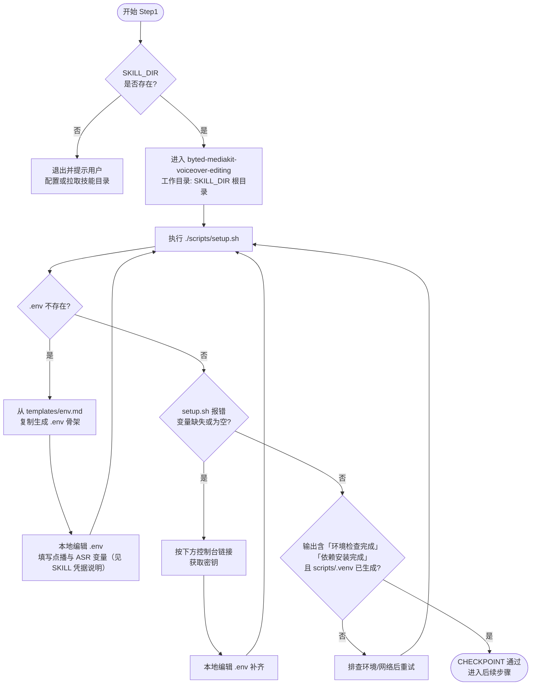

# Step1: 环境检查与依赖安装

> **目标**：检查环境是否符合要求，若不符合则提示用户配置环境变量
>
> **SKILL_DIR**：指 `byted-mediakit-voiceover-editing` 目录路径
>
> **前置要求**：必须在 `./scripts` 目录下执行本步骤命令

# 检查单

- [ ] 确认 `<SKILL_DIR>` 是否存在
- [ ] 存在切换到 `byted-mediakit-voiceover-editing`
- [ ] 不存在退出并提示用户
- [ ] 存在继续下面流程
- [ ] Run: `./scripts/setup.sh`
- [ ] 若不存在 `<SKILL_DIR>/.env`，脚本会从 `templates/env.md` **复制生成** `.env` 骨架；**不会**自动写入云厂商密钥。模板**不含** `ARK_SKILL_*`（由宿主/容器注入进程环境）。须在 `.env` 或环境中配置：`VOLC_SPACE_NAME`、`ASR_*`；VOD 鉴权为 **apig**（环境中 `ARK_SKILL_*` 皆有值）或 **cloud**（`VOLC_ACCESS_KEY_*`）二选一。
- [ ] 若 `setup.sh` 报错：脚本**优先查进程环境、再查 `.env`**。APIG 下按提示补 `VOLC_SPACE_NAME`、`ASR_*`（可写 `.env` 或注入环境）；`ARK_SKILL_*` 由部署注入即可，无需写入 `.env`。
- [ ] 相关参考文档如下

```text
视频点播密钥获取：  https://console.volcengine.com/iam/keymanage
视频点播空间获取：  https://console.volcengine.com/vod
豆包语音ASR密钥& BASE URL 获取： https://console.volcengine.com/speech/new/experience/asr?projectName=default
```

- [ ] **CHECKPOINT**: 确认 `./scripts/setup.sh` 输出包含 `环境检查完成` 与 `依赖安装完成`，且 `./scripts/.venv/` 已生成

# 使用流程示意



> **说明**：若你当前工作目录已是 `<SKILL_DIR>/scripts`，则等价执行 `./setup.sh`（与从根目录执行 `./scripts/setup.sh` 一致）。
