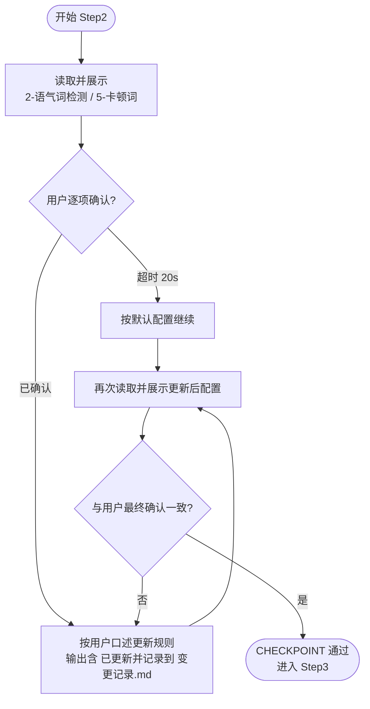

# Step2: 语气词提示与用户行为更新

> **目标**：在执行 ASR/剪辑前，先让用户确认并更新规则配置（语气词/卡顿词），避免误删或误标记
>
> **SKILL_DIR**：指 `byted-mediakit-voiceover-editing` 目录路径
>
> **前置要求**：必须在 `./scripts` 目录下执行本步骤命令
>
> **超时**：20 秒内无回复 → 按默认配置执行
>
> **强制 Gate**：Step2 完成后必须生成 `output/<任务>/step2_config_confirmed.json`，否则不得进入 Step3（脚本会阻断继续执行）。

# 检查单

- [ ] 展示当前配置（**必须让用户看见并逐项确认**）
  - [ ] **读取文件** `references/用户规则/2-语气词检测.md` 、`references/用户规则/5-卡顿词.md`，提取并展示以下配置项供用户确认：
    - 单个语气词策略、语气词列表、保留语气词列表
    - 卡顿词模式
  - [ ] **CHECKPOINT**：用户已逐项确认

- [ ] 根据用户口述执行变更（仅更新规则配置，不跑剪辑流程）
  - [ ] **CHECKPOINT**：命令输出出现 `✅ 已更新并记录到 变更记录.md`

- [ ] 再次展示更新后的列表（用于最终确认）
  - [ ] **读取文件**`references/用户规则/2-语气词检测.md` 、`references/用户规则/5-卡顿词.md`，展示更新后的配置
  - [ ] **CHECKPOINT**：配置与用户最终确认一致
  - [ ] 生成 Step2 checkpoint（必须）：
    - [ ] 运行：`python step2_confirm_config.py --output-dir <output/<任务目录>>`
    - [ ] **CHECKPOINT**：输出出现 `Step2 checkpoint 已生成: .../step2_config_confirmed.json`

# 使用流程示意

