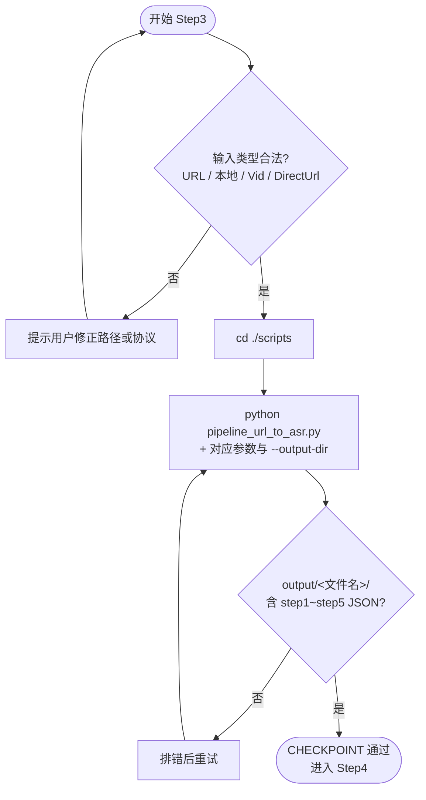

# Step3: URL → ASR 流水线 + 候选生成

> **目标**：从视频/素材提取音频，经人声分离/降噪后输出 ASR 结果（JSON），并生成流水线候选产物
>
> **SKILL_DIR**：指 `byted-mediakit-voiceover-editing` 目录路径
>
> **前置要求**：必须先 `cd <SKILL_DIR>/scripts`，且在已激活的 `scripts/.venv` 下执行（`setup.sh` 会创建并 `pip install -r requirements.txt`）
>
> **说明**：**URL 或本地路径**作为首个位置参数传入时会走上传；**`--vid`** 用于已有 Vid（跳过上传）；**`--directurl`** 仅用于 VOD 空间内已有资源的 FileName（跳过上传）。

# 检查单

- [ ] **前置校验**（避免链路失败）：执行前必须验证用户输入类型
  - 若为 URL：**必须**以 `http://` 或 `https://` 开头，否则提示用户修正
  - 若为本地文件：**必须**确认文件存在，否则提示用户
- [ ] Run：
  - 必须先进入 scripts 目录并激活虚拟环境：
    - `cd ./scripts`
    - `source .venv/bin/activate`（或由 `setup.sh` 已安装依赖的同一 venv）
  - **URL 或本地文件（会执行上传）**：`python ./pipeline_url_to_asr.py "<url_or_local_path>" --ext ".mp4" [--output-dir output/<文件名>]`
  - **已有 Vid（跳过上传）**：`python ./pipeline_url_to_asr.py --vid "<vid>" --ext ".mp4" [--output-dir output/<文件名>]`
  - **已有 DirectUrl（VOD 空间内 FileName，跳过上传）**：`python ./pipeline_url_to_asr.py --directurl "<filename>" --ext ".mp4" [--output-dir output/<文件名>]`
- [ ] **用户输入说明**：
  - **URL**：公网素材地址，必须以 `http://` 或 `https://` 开头
  - **本地文件**：本地路径作为**第一个位置参数**传入（如 `./Test_Video_720p.mp4`），**禁止**用 `--directurl` 传本地路径
  - **Vid**：视频 ID，示例：`v02399g100***2qpj9aljht4nmunv9ng`
  - **DirectUrl**：VOD 空间内已存在资源的 FileName（如 `abc123.mp4`），**非**本地路径；本地文件应走上传流程
- [ ] **CHECKPOINT（流水线产物）**：确认 `output/<文件名>/` 目录下已生成：
  - `step1~step5` 的 JSON 文件（上传/识别已有素材、提取音频、人声分离、降噪、ASR 结果）
  - 注意：输出目录位于工程根目录，按主 SKILL 中「输出目录与重复处理规则」确定

# 使用流程示意

