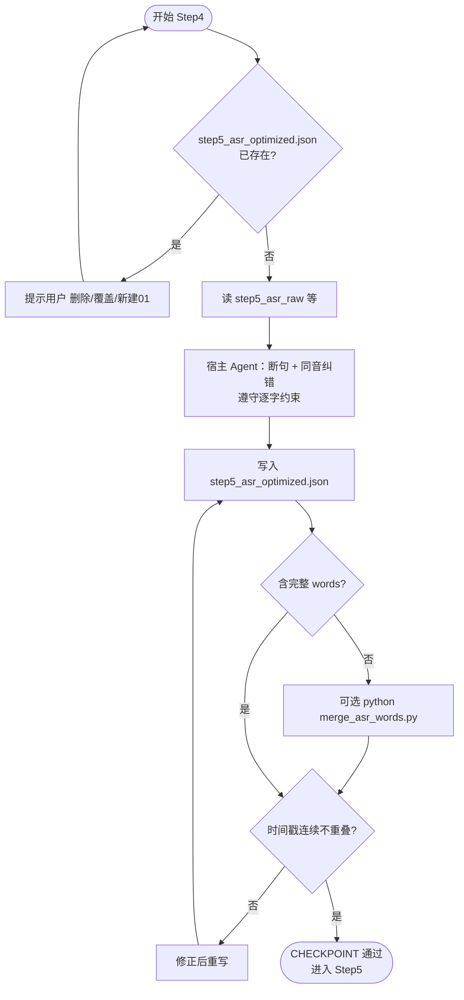

# Step4: 宿主 Agent ASR 纠错（必须）

> **目标**：通过宿主 Agent 提升 ASR 断句与字词准确率；**仅**做断句与字词修正，**不做**口癖/语气词去除（口癖在 Step5）
>
> **执行者**：宿主 Agent（你）
>
> **SKILL_DIR**：指 `byted-mediakit-voiceover-editing` 目录路径
>
> **参考文件**：`references/内置/ASR语义纠错.md`
>
> **前置要求**：在 `./scripts` 目录下如需运行合并脚本，在已激活的 `scripts/.venv` 中使用 `python ./merge_asr_words.py`

# 检查单

- [ ] **重复文件检查**：若 `output/<文件名>/step5_asr_optimized.json` 已存在，**必须提示用户**：「step5_asr_optimized.json 已存在，是否删除/覆盖/保留并写入新目录(01)？」用户确认后再执行
- [ ] **输入文件**：ASR 处理结果（step5 相关产物）

- [ ] **宿主 Agent 执行任务**（仅限以下两项）：
  - [ ] **断句**（必做）：标点恢复优化、语义化断句；超长句（>15 字）**必须**按语义边界拆分为多 segment，单段建议 ≤10 字
  - [ ] **字词准确率**：同音词纠错（基于上下文修正同音词错误，如 的/地/得、在/再 等；勿硬编码特定词，如 这都 等由 Step5 口播剪辑移除）
  - [ ] **逐字约束**：输出必须与 ASR 原始字级时间戳（`step5_asr_raw_*.json` 的 words 结构）逐字对应，**不能多字、不能少字**，仅可替换同音字，`start_time`/`end_time` 取自源数据
  - [ ] ❌ **禁止**：
    - 删除或合并重复词（一个一个、那个那个）
    - 删除或改写 嗯、啊、呃 等口癖/语气词
    - 删除 就是、其实、比如说、它 等顺句词
    - 删除「的」或改写句式（由 Step5 处理）

- [ ] **输出**：
  - 将优化结果写入 `output/<文件名>/step5_asr_optimized.json`（**必须**使用上下文推导的 output-dir，勿写 output 根目录）
  - **禁止**创建「简化版」或占位符；必须完整执行 ASR 纠错，格式与 words 逐字结构缺一不可
  - **必须**从 `step5_asr_raw_*.json` 读取 utterances[].words 逐字结构，每个 segment 含 `words` 数组（与源一致，仅纠正字可替换 text）
  - 格式：`{ "optimized_segments": [{ "text": "...", "source_text": "", "start_time": 0.23, "end_time": 7.47, "words": [{ "text": "大", "start_time": 630, "end_time": 870 }, ...] }] }`
  - 说明：`words` 时间为毫秒；segment 的 start/end 为秒（Step6a 会依 words 字级时间校正）
  - 若输出缺 `words`，可运行 `python ./merge_asr_words.py [--output-dir output/<文件名>]` 从 raw 合并

- [ ] **CHECKPOINT**：优化结果，时间戳连续不重叠

# 使用流程示意

