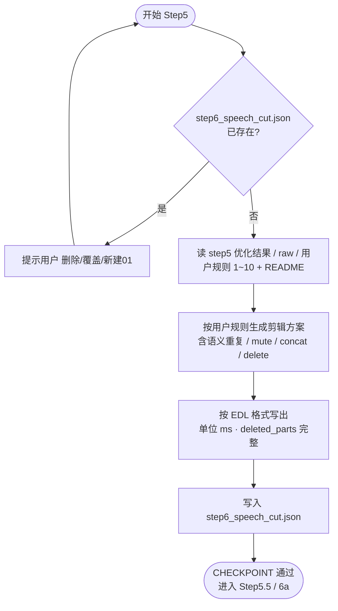

# Step5: 宿主 Agent 口播剪辑

> **目标**：基于 Step4 纠错结果与用户规则，生成可审核的口播剪辑方案（sentences + track），输出 `step6_speech_cut.json`
>
> **执行者**：宿主 Agent（你）
>
> **SKILL_DIR**：指 `byted-mediakit-voiceover-editing` 目录路径
>
> **参考文档**：`references/用户规则/*.md`、`references/内置/EDL编辑决策格式.md`、`examples/edl.json`

## **强制阅读清单（必须逐文件读完）**

> 注意：**不得只读 `references/用户规则/README.md`**。Step5 必须按下列清单逐个读取并在输出中体现命中情况（见“输出自证”）。
>
> 禁止用“在工作区搜索 `*.md`”来代替逐文件阅读（搜索只能用于定位，不视为已读）。

- `references/用户规则/README.md`（优先级总览）
- `references/用户规则/1-核心原则.md`
- `references/用户规则/2-语气词检测.md`
- `references/用户规则/3-静音段处理.md`
- `references/用户规则/4-重复句检测.md`
- `references/用户规则/5-卡顿词.md`
- `references/用户规则/6-句内重复检测.md`
- `references/用户规则/7-连续语气词.md`
- `references/用户规则/8-重说纠正.md`
- `references/用户规则/9-残句检测.md`
- `references/用户规则/10-顺句词删除.md`
- `references/用户规则/已更新并记录到 变更记录.md` (如存在的话)

# 检查单

- [ ] **重复文件检查**
  - [ ] 若用户**未显式指定 `--output-dir`**：默认会写入 `output/<素材名(_01)>/`（目录冲突会自动递增 `_01/_02`），避免覆盖既有任务目录
  - [ ] 若用户**显式指定了 `--output-dir`** 且 `step6_speech_cut.json` 已存在：**必须提示用户**「是否删除/覆盖/保留并写入新目录(\_01)」，用户确认后再执行
- [ ] **读取文件**（从 `output/<文件名>/` 读取）：
  - [ ] ASR 纠错结果：`output/<文件名>/step5_asr_optimized.json`（含 words 逐字，时间 ms）
  - [ ] ASR 原始文本：`output/<文件名>/step5_asr_raw_*.json`（用于字级时间戳/上下文）
  - [ ] 流水线产物（可选）：`output/<文件名>/step3_voice_separation_result.json`（拿人声/背景音 DirectUrl）
- [ ] **内容处理**（先执行逻辑，再按 EDL 格式输出）
  - [ ] **按优先级执行（强制）**：必须按 `references/用户规则/README.md` 的 1～8 优先级顺序生成剪辑方案（静音 → 残句 → 重复句 → 句内重复 → 卡顿词 → 重说纠正 → 顺句词/口误 → 语气词）
  - [ ] **规则命中必须可追溯**：对每个被删/静音/拼接的段，在 `reason` / `reasonTags` 中明确写出命中的规则文件（例如：`规则命中：4-重复句检测`、`规则命中：10-顺句词删除`）
  - [ ] **语义重复检查（必做）**：参考 `references/用户规则/4-重复句检测.md`，**先**逐对检查相邻句语义重复。典型：前句「XX 原理是/其实是」+ 后句「我来说一下 XX 流程/方法」→ 前句为过渡铺垫，**整段 delete**，不做句内 concat。
  - [ ] **无说话段显式标记**：开头（如 0–230ms）、片段间所有无说话区间**必须在 output 中显式列出**，`action: mute`，便于静音处理、避免噪音，格式如 `{ "text": "", "reason": "无说话 0–230ms，静音处理避免噪音", "action": "mute", "actionTime": [{"start_time": 0, "end_time": 230}] }`
  - [ ] **删除/静音内容需明确**：`reason` 必须标明具体删除或静音了什么内容。例如：句内静音删除重复词时写「句内静音 5310-5950ms，删除「一个」」；无说话段写「句内静音 X-Yms，无说话，静音处理」或「开头 0-Xms 无说话，静音处理（无内容）」。
  - [ ] **片段间静音**：无说话段**保留时长**，用 `mute` 做静音处理（不删时长）；`delete` 仅用于冗余内容（如重复句整句）
  - [ ] **禁止添加原文不存在的内容**：`text` 必须来自 `source_text` 对应时间范围内的字，**不得**插入、替换为原文不存在的词（如 source 为「比如说」时不得输出「比如剪映」）
  - [ ] **举例结构保护**：当 嗯啊呃 等作为举例内容出现（如「比如说，嗯啊呃这种」）时，**不得删除**，否则「这种」无指代
  - [ ] **句内 concat**：删除重复词/顺句词时，用 `concat` + `actionTime` 列出**仅保留**的 trim 范围（**仅在无语义重复时**做句内剪辑）
  - actionTime 必须从 step5 words 逐字查得保留部分的 start/end，**不能**填整段 segment 的起止；否则人声轨会保留被删内容导致音频仍播放
  - **concat 的 start_time**：**必须**为原句在源中的起始时间（含被删部分），不得写成保留部分起始；否则删前内容无法在 review 展示
  - **删前留后 actionTime**：从**保留词首字**开始（如「这个这个」留第二个「这个」→ 从第二个「这」的 start_time），不得从下一字开始否则多删
  - **deleted_parts**：对应删前内容时，`end_time` 须延伸至首个保留字前（如「其实啊」后接「做」→ end_time 为「做」的 start_time）
  - [ ] **顺句词/口误移除**：参考 `10-顺句词删除.md`，如 这都、其实、那个 等在口播剪辑阶段**直接移除**
  - [ ] `deleted_parts` 每条需含 `deleted_text`、`description`；建议含 `start_time`、`end_time`（便于 Step6a 自检）；删前留后时 `end_time` 须延伸至首个保留字前
  - [ ] `reasonTags` 命名规范：`建议删除：静音 76.47s–96.93s（20.5s）`
  - [ ] 产出可审核的数据结构：sentences + track
- [ ] **EDL 输出格式**（见 `references/内置/EDL编辑决策格式.md`、`examples/edl.json`）
  - [ ] **单位统一为 ms**（start_time、end_time、actionTime）
  - [ ] **reason**：明确处理原因（如「句内重复：一个一个，删前留后」「顺句词：这都，直接移除」「语义重复：前句过渡后句完整，删前留后」）
  - [ ] **action**：`mute` 静音 | `delete` 删除 | `concat` 句内拼接 | `keep` 保留
  - [ ] **delete 段 text 字段**：`text` 应填 `source_text`（被删除的原文），便于审核页展示「删除了什么」
  - [ ] **concat 与 deleted_parts 一致**：actionTime 的保留区间不得与 deleted_parts 重叠；显式 mute 段的时间不得与 keep 重叠
  - [ ] **actionTime**：`mute`/`delete` 填待处理范围；`concat` 填**仅保留**的 trim 片段列表（按顺序拼接）
  - **严禁**将 segment 整段填入 actionTime：若 reason 为「删前留后」等删除类，actionTime **必须**从 step5 字级时间戳查出被保留字的精确 ms 范围，**不得**包含被删部分；否则音频仍会播放被删内容
- [ ] **结果输出**：
  - `output/<文件名>/step6_speech_cut.json`：口播剪辑结果。顶层键可为 `optimized_segments` 或 `sentences`，prepare_export_data 均支持
  - **禁止**与 Step4 同时输出；Step5 必须在 Step4 完整完成后独立执行，不得用「简化版」跳过
  - 必须含 `deleted_parts`（每条 delete 段需有对应项，含 `deleted_text`、`description`，建议含 `start_time`、`end_time` 便于自检）
- [ ] **输出自证（防止漏读用户规则）**：在 `step6_speech_cut.json` 顶层增加以下字段（不影响后续脚本解析）：
  - `rules_read`: 本次完整读取的规则文件列表（必须包含 `references/用户规则/` 下 1～10 全部文件名 + `README.md`）
  - `rules_applied`: 本次实际命中的规则文件列表（例如 `["3-静音段处理", "4-重复句检测", "10-顺句词删除"]`）
  - `rules_version_note`: 固定写 `read all references/用户规则/*.md`
- [ ] **CHECKPOINT**：确认每一步都完全执行

# 使用流程示意

