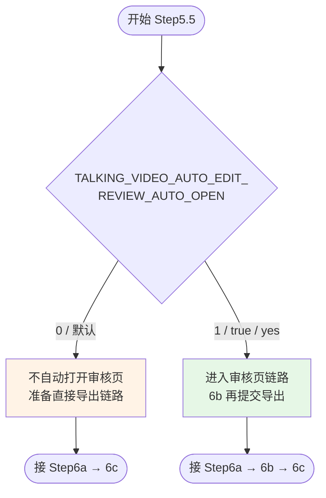

# Step5.5: 审核逻辑确认（是否打开审核页面）

> **目标**：根据环境变量决定后续是「先审后导出」还是「直接进入导出准备」
>
> **SKILL_DIR**：指 `byted-mediakit-voiceover-editing` 目录路径
>
> **关键变量**：`TALKING_VIDEO_AUTO_EDIT_REVIEW_AUTO_OPEN`（见主 SKILL frontmatter 说明）

# 检查单

- [ ] **启动审核页面前置判断**：查看环境变量 `TALKING_VIDEO_AUTO_EDIT_REVIEW_AUTO_OPEN` 判断是否打开，0 不打开、1 打开，根据信息控制 Step6b 审核页面打开逻辑
  - [ ] 不打开的情况下需要直接进行视频导出（进入 6a → 6c 路径，跳过人工在审核页的交互）
  - [ ] 打开情况下需要不直接进行视频导出（需经过 6b 审核与导出服务交互后再 6c）

# 本地模式审核页支持

**所有三种模式（apig / cloud / local）均支持审核页。** 本地模式下审核页的特殊处理：

- **媒体访问**：Source 字段使用 `http://127.0.0.1:<port>/local-media/<绝对路径>` 格式，由 `serve_review_page.py` 的 `/local-media/` 路由代理访问本地文件
- **模式标识**：审核页自动检测 `review_import_data.json` 中的 `_execution_mode` 字段，显示对应的模式徽标
- **导出方式**：本地模式点击导出后使用 ffmpeg 本地合成，不调用 VOD 服务
- **数据联动**：点击"💾 保存审核"可将修改持久化，直接导出时也会读取最新数据

# 使用流程示意

> **注意**：无论哪种模式，审核页均可用。即使 `TALKING_VIDEO_AUTO_EDIT_REVIEW_AUTO_OPEN=0`，用户仍可手动访问审核页 URL 进行审核。
