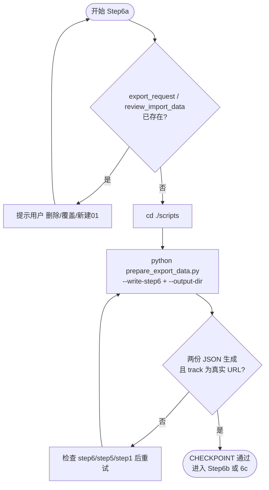

# Step6a: 数据预处理

> **目标**：将 Step6 剪辑决策与 Step1/3/5 等产物合并为 `export_request.json`、`review_import_data.json`（含真实 URL），供审核页与 VOD 导出使用
>
> **SKILL_DIR**：指 `byted-mediakit-voiceover-editing` 目录路径
>
> **前置要求**：必须先 `cd ./scripts` 并激活 `scripts/.venv` 再执行命令

# 检查单

- [ ] **重复文件检查**：若 `output/<文件名>/export_request.json` 或 `review_import_data.json` 已存在，**必须提示用户**：「导出数据已存在，是否删除/覆盖/保留并写入新目录(01)？」用户确认后再执行
- [ ] Run（需先 `cd ./scripts` 且已激活 venv）：`python ./prepare_export_data.py --write-step6 [--output-dir output/<文件名>]`（画布与视频源从 step1 读取，可加 `--width` `--height` 指定）
- [ ] **脚本职责**：
  - 读取 step6、step3、step1、step5
  - 以 step5 字级时间戳校正 segment 起止（首字出现、末字结束）；无 step5_asr_optimized 时回退 step5_asr_raw
  - 人声轨不输出 mute 段；字幕去除结尾标点；有留白时 10ms 补偿
  - 自检：delete 段应在 deleted_parts 中
  - 生成 `export_request.json`、`review_import_data.json`（含真实 URL）
- [ ] **导出无字幕**：默认跳过字幕压制；如需启用字幕压制，`.env` 中设置 `VOD_EXPORT_SKIP_SUBTITLE=0`（或 `false`/`no`）；6a、6b、6c 均生效
- [ ] **导出视频裁剪**：`.env` 中设置 `TALKING_VIDEO_AUTO_EDIT_VIDEO_CUT=1`（默认 1 进行），且**仅有字幕或音频静音**时生效：mute 段会从输出中移除，视频轨与人声轨均按 keep 段无缝拼接，主时间轴从 0 起连续；Extra.trim 保持源时间范围
- [ ] **CHECKPOINT**：两份 JSON 已生成，track 使用真实 URL

# 使用流程示意

