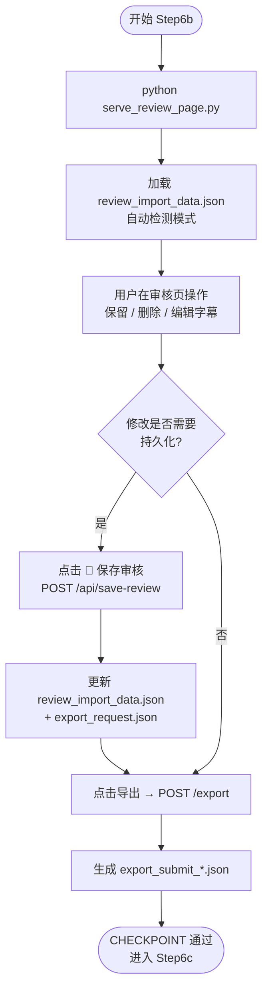

# Step6b: 审核与导出

> **目标**：本地启动审核页与导出服务，由用户在页面完成字幕/句级决策后提交导出数据
>
> **SKILL_DIR**：指 `byted-mediakit-voiceover-editing` 目录路径
>
> **前置要求**：必须先 `cd ./scripts` 并激活 `scripts/.venv`；默认是否自动打开浏览器由 `TALKING_VIDEO_AUTO_EDIT_REVIEW_AUTO_OPEN` 决定，可加 `--no-open` 覆盖

# 检查单

- [ ] **示例参考**：`examples/step6_speech_cut.json`
- [ ] **启动审核页面前置判断**：默认不自动打开；是否打开由 `TALKING_VIDEO_AUTO_EDIT_REVIEW_AUTO_OPEN` 决定（`1`/`true`/`yes` 时打开）。
- [ ] **启动审核页服务**：`python ./serve_review_page.py [--output-dir output/<文件名>]`（默认 5173，端口冲突时自动使用其他端口，以启动时打印的 URL 为准）
- [ ] **审核页**：默认不自动打开；用户可手动打开启动时打印的 URL（默认 http://127.0.0.1:5173），点击「从 API 加载」或自动加载 review_import_data
- [ ] **用户审核**：修改字幕、删除/保留句、调整时间
- [ ] **操作仅两类**：**保留**（原样输出）| **删除**（可恢复）
  - 删除-音频：`a_volume: 0` 静音，恢复时设为 1
  - 删除-字幕：`Extra[transform].Alpha: 0` 隐藏画布渲染，恢复时设为 1

# 模式区分

审核页自动检测执行模式并在界面上区分显示：

| 模式 | 徽标颜色 | 导出按钮文案 | 导出成功信息 |
|------|---------|-------------|-------------|
| **apig** | 🔵 蓝色 | 提交视频导出任务 | OutputVid + PlayURL |
| **cloud** | 🟢 绿色 | 提交视频导出任务 | OutputVid + PlayURL |
| **local** | 🟠 橙色 | 本地导出视频 | 输出文件路径 |

# 数据联动

审核页修改与直接导出之间通过"保存审核"机制实现数据同步：

```
审核页编辑 → 点击"💾 保存审核" → POST /api/save-review
                                        ↓
                          ┌──────────────────────────────────┐
                          │ 1. 更新 review_import_data.json  │
                          │ 2. 重新生成 export_request.json   │
                          └──────────────────────────────────┘
                                        ↓
                          直接导出（vod_direct_export.py）     
                          读取到更新后的 export_request.json ✅
```

**两种导出路径**：

| 路径 | 入口 | 数据来源 |
|------|------|---------|
| **审核页导出** | 审核页点击"导出"按钮 | 浏览器内存中的最新编辑数据（实时） |
| **直接导出** | Agent 调用 `vod_direct_export.py --output-dir <绝对路径> submit --wait` | 磁盘上的 `export_request.json`（需先"保存审核"） |

> **注意**：如果用户在审核页做了修改但**未点击"保存审核"**就关闭页面，修改会丢失。直接导出将使用 Step 6a 的原始数据。

- [ ] **保存审核**：用户修改后点击"💾 保存审核"，将修改持久化到磁盘
- [ ] **导出**：点击「导出」按钮，数据保存至 `output/export_submit_<ts>.json` 并触发导出
- [ ] **CHECKPOINT**：用户完成审核并成功导出，Agent 可读取 `export_submit_*.json` 反馈结果

# 服务端点一览

| 端点 | 方法 | 说明 |
|------|------|------|
| `/` | GET | 审核页 HTML |
| `/api/review-data` | GET | 返回 review_import_data.json |
| `/api/mode` | GET | 返回当前执行模式 |
| `/api/save-review` | POST | 保存审核修改（回写 review_import_data + 重生成 export_request） |
| `/export` | POST | 触发导出（local: ffmpeg; cloud/apig: vod_direct_export） |
| `/local-media/<path>` | GET | 本地模式媒体文件代理 |

# 使用流程示意


