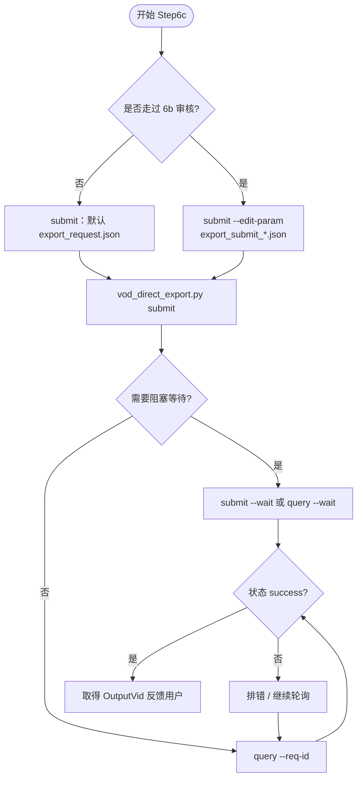

# Step6c: VOD 导出任务提交与查询

> **目标**：向火山 VOD 提交直接剪辑任务并轮询结果，获得 OutputVid 等成功产物
>
> **SKILL_DIR**：指 `byted-mediakit-voiceover-editing` 目录路径
>
> **前置要求**：依赖 `.env` 中 `VOLC_*` 等配置

# 检查单

> ⚠️ **重要**：`--output-dir` 必须在 `submit`/`query` 子命令**之前**，支持绝对路径。

- [ ] **提交任务**（一行式执行）：
  ```bash
  cd SKILL_DIR/scripts && source .venv/bin/activate && python vod_direct_export.py --output-dir <绝对路径> submit --wait
  ```
  - 指定输入文件：追加 `--edit-param <JSON绝对路径>`
  - 覆盖 UploadInfo：追加 `--space-name`、`--video-name`、`--file-name`
- [ ] **查询结果**（一行式执行）：
  ```bash
  cd SKILL_DIR/scripts && source .venv/bin/activate && python vod_direct_export.py query --req-id <ReqId> --wait
  ```
- [ ] **CHECKPOINT**：任务 success 时获得 OutputVid，可反馈用户

# 使用流程示意


